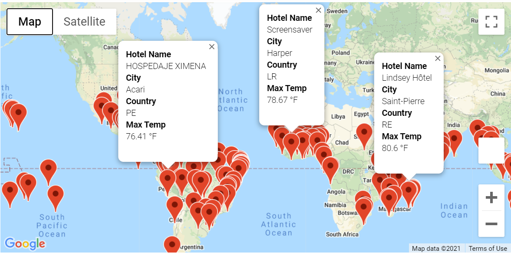
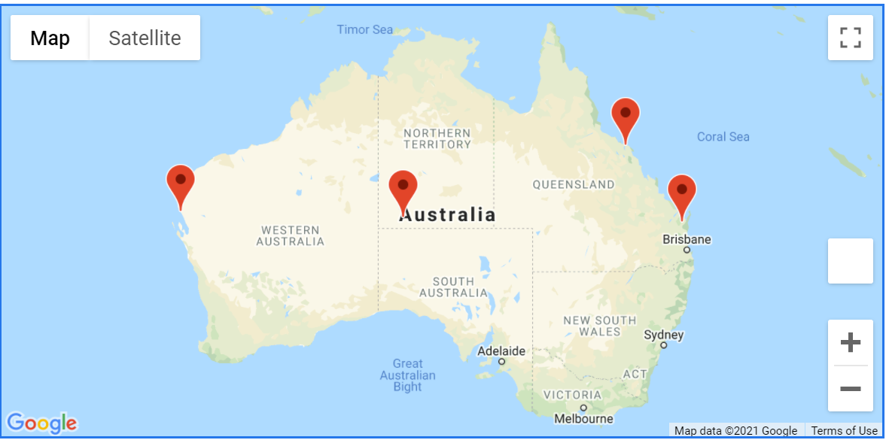
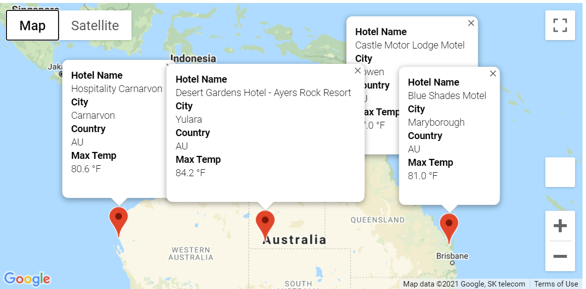

# World_Weather_Analysis

## Project Overview
This project involves the use of Python and Jupyter Notebook to develop a travel itinerary map.

## Resources
- Data Source: 
- Software: Python and Jupyter Notebook

## Purpose
This project includes three main deliverables:

- Deliverable 1: Retrieve Weather Data
- Deliverable 2: Create a Customer Travel Destinations Map
- Deliverable 3: Create a Travel Itinerary Map

## Results
The following maps are the visual products of this project.

### Customer Travel Destinations Map

### Travel Itinerary Map & Map with Markers

